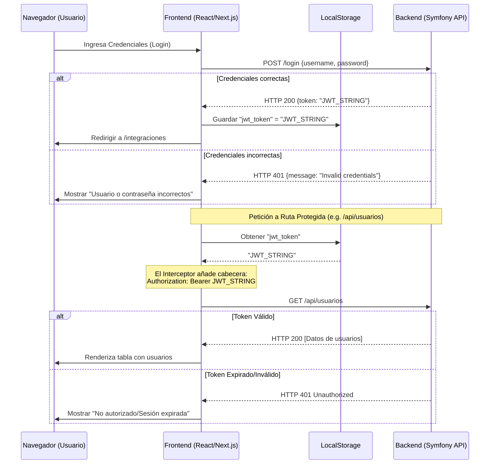

# Guía de Integración API & Autenticación JWT en el Frontend

Esta guía explica en detalle cómo está estructurado el flujo de conexión entre nuestro frontend (React + Next.js + Shadcn UI) y el backend en Symfony 7.3 + API Platform 4, utilizando autenticación **stateless JWT** (JSON Web Tokens).

Está pensada especialmente para desarrolladores que trabajan por primera vez con esta arquitectura.

---

## 1. ¿Cómo funciona la Autenticación Stateless con JWT?

En una arquitectura clásica (con sesiones y cookies), el servidor recuerda quién eres guardando un identificador de sesión en su memoria o base de datos.
En una arquitectura **stateless** (sin estado) con JWT:
1. El servidor **no guarda información** de las sesiones de los usuarios.
2. Cuando envías tus credenciales correctas a `/login`, el servidor firma un token JWT y te lo devuelve.
3. El token es un string largo y encriptado que contiene tus datos (como tu nombre de usuario y roles) y una fecha de expiración.
4. El frontend guarda este token en el navegador (en `localStorage`).
5. En cada petición subsiguiente a las rutas protegidas del backend (`/api/*`), el frontend adjunta el token en la cabecera HTTP `Authorization` con el formato `Bearer <token>`.
6. El backend valida la firma del token. Si es correcto, procesa la petición; si expiró o es inválido, devuelve un código **HTTP 401 Unauthorized**.

---

## 2. Componentes Clave de la Implementación

A continuación, se detalla qué hace cada archivo creado o modificado en nuestro frontend.

### A. Generador de Código y Tipos: `openapi-ts.config.ts`

Escribir a mano cada tipo de TypeScript y cada llamada de `fetch()` para decenas de endpoints es lento y propenso a errores. Para automatizarlo, usamos `@hey-api/openapi-ts`.

*   **Archivo**: [`openapi-ts.config.ts`](file:///d:/SymfonyProyects/shadcn-dashboard-ui/openapi-ts.config.ts)
*   **¿Qué hace?**: Le indica al compilador de Hey API dónde encontrar el esquema OpenAPI generado por Symfony (`../symfony-api-base/openapi/openapi.json`) y dónde generar el código del SDK (`lib/api/generated`). Utiliza el plugin `@hey-api/client-fetch` para generar funciones listas para consumir.
*   **Comando de ejecución**: `npm run openapi-ts`. Esto genera todos los tipos TS y funciones como `getUsuarioCollection()` o `postLogin()`.

### B. Configuración Global del Cliente: `lib/api.ts`

Este es el núcleo de la conexión de red en tu aplicación.

*   **Archivo**: [`lib/api.ts`](file:///d:/SymfonyProyects/shadcn-dashboard-ui/lib/api.ts)
*   **¿Qué hace?**: 
    1. Define la URL base de tu backend (`http://localhost:8000`) de forma centralizada.
    2. Registra un **interceptor de request** (petición). Un interceptor es una función que se ejecuta automáticamente *antes* de que cualquier petición salga hacia el servidor.
    3. Si hay un token guardado bajo la clave `"jwt_token"` en el `localStorage`, el interceptor lo inyecta automáticamente en la cabecera `Authorization` de la petición HTTP.
    4. Re-exporta todos los servicios autogenerados para que los importes fácilmente en tus páginas.

```typescript
// Interceptor que inyecta el token en cada petición
client.interceptors.request.use((request) => {
  if (typeof window !== "undefined") {
    const token = localStorage.getItem("jwt_token");
    if (token) {
      request.headers.set("Authorization", `Bearer ${token}`);
    }
  }
  return request;
});
```

### C. Abstracción del Formulario: `components/ui/form.tsx`

*   **Archivo**: [`components/ui/form.tsx`](file:///d:/SymfonyProyects/shadcn-dashboard-ui/components/ui/form.tsx)
*   **¿Qué hace?**: Este componente es parte del sistema de Shadcn UI. Envuelve a la librería `react-hook-form` y se integra con `zod` y `radix-ui`. Provee componentes semánticos y accesibles (`Form`, `FormLabel`, `FormControl`, `FormMessage`) que automatizan la presentación de errores de validación sin necesidad de mapearlos manualmente en cada input.
*   **Ajuste Técnico**: Usa `Slot.Root` de Radix para inyectar propiedades de accesibilidad al input hijo directo de forma limpia.

### D. Formulario de Inicio de Sesión: `components/auth/login-form.tsx`

Este componente gestiona el inicio de sesión del usuario.

*   **Archivo**: [`components/auth/login-form.tsx`](file:///d:/SymfonyProyects/shadcn-dashboard-ui/components/auth/login-form.tsx)
*   **¿Qué hace?**:
    1. **Esquema de Validación**: Define con Zod que el usuario y la contraseña no pueden estar vacíos.
    2. **Envío de Credenciales**: Envía un `POST` al endpoint stateless `/login`.
    3. **Captura de Errores Específicos del Servidor**:
        - **HTTP 401**: Credenciales inválidas. Marcamos los campos de usuario y contraseña como erróneos mediante `form.setError` y mostramos un banner.
        - **HTTP 429**: Límite de peticiones de login superado (prevención de ataques de fuerza bruta). Mostramos un mensaje de advertencia.
    4. **Persistencia del Token**: Si el login es exitoso, guarda el JWT retornado en `localStorage.setItem("jwt_token", token)` y redirige al usuario dentro de la aplicación.
    5. **Opción "Recordar usuario"**: Guarda el nombre de usuario para pre-completarlo en la próxima visita.

### E. Consumo de Rutas Protegidas: `components/auth/usuario-list.tsx`

Muestra cómo consumir datos autenticados y renderizarlos.

*   **Archivo**: [`components/auth/usuario-list.tsx`](file:///d:/SymfonyProyects/shadcn-dashboard-ui/components/auth/usuario-list.tsx)
*   **¿Qué hace?**:
    1. Llama a la función autogenerada `getUsuarioCollection()`. Dado que tenemos el interceptor en `lib/api.ts`, esta petición llevará automáticamente la cabecera `Authorization: Bearer <token>` sin tener que escribirla de nuevo.
    2. **Manejo de estados**: Muestra un spinner animado (`Loader2`) mientras carga y un banner de error si falla la conexión o si el servidor devuelve un `401` (indicando que la sesión JWT expiró).
    3. **Compatibilidad con API Platform (JSON-LD / Hydra)**: API Platform suele envolver las colecciones en un objeto con metadatos. El código comprueba si los datos vienen directamente en un array o dentro de la propiedad `"hydra:member"` para asegurar compatibilidad y estabilidad.
    4. Renderiza los datos en una tabla semántica de Shadcn UI.

---

## 3. Flujo Completo de Navegación del Token



---

## 4. Mantenimiento y Trabajo Diario

Cuando el equipo del Backend agregue o modifique endpoints en la API de Symfony:
1. Asegúrate de tener el archivo OpenAPI actualizado en `../symfony-api-base/openapi/openapi.json`.
2. Ejecuta `npm run openapi-ts` en la raíz del frontend.
3. Las funciones y tipos en `lib/api/generated` se actualizarán automáticamente. Podrás importarlos directamente en tus páginas de React con soporte de autocompletado e validación estática de TypeScript.


