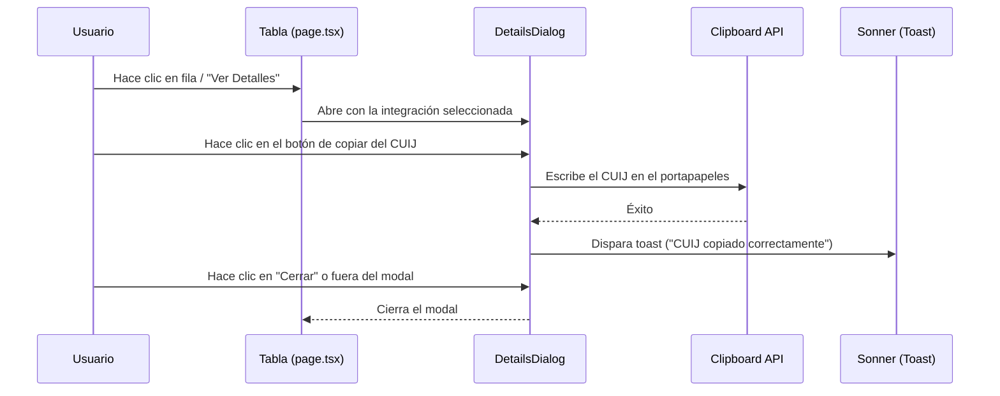

# Especificación de Diseño: Tabla de Integraciones y Modal de Detalles

Este documento detalla el diseño de interfaz (UI) y de experiencia de usuario (UX) para optimizar la visualización y gestión de integraciones en el panel del Poder Judicial de Santa Fe.

- **Fecha:** 2026-06-26
- **Estado:** Aprobado por el usuario
- **Módulo Principal:** Integraciones (`/integraciones`)
- **Enfoque Técnico:** Componentes Reutilizables de Dashboard

---

## 1. Arquitectura de Componentes

Para asegurar consistencia visual y escalabilidad, implementaremos una arquitectura basada en componentes compartidos:

### 1.1 `PageHeader` (`components/page-header.tsx`)
Un componente de cabecera estándar que recibirá:
- `title`: Título de la página (ej. "Gestión de Integraciones").
- `description`: Subtítulo o descripción (ej. "Visualiza y filtra...").
- `action`: Botón o elemento de acción principal (ej. "Nueva Integración").

### 1.2 `TableToolbar` (`components/table-toolbar.tsx`)
Un componente que unifica las operaciones de filtrado, búsqueda y exportación en una sola fila compacta:
- **Búsqueda:** Campo de texto (`Input` con icono de lupa) limitado a un ancho máximo en desktop (`max-w-xs md:max-w-sm`).
- **Filtros Rápidos:** Selectores interactivos (`Select`) para segmentar por Presidencia, Año o Estado.
- **Botón "Limpiar Filtros":** Aparecerá solo cuando haya filtros activos.
- **Acciones de Exportación:** Botones discretos en formato `outline` (CSV, PDF, Imprimir) alineados a la derecha.

### 1.3 `StatusBadge` (`components/status-badge.tsx`)
Componente para etiquetas de estado judiciales:
- Muestra el estado del registro con fondo pastel suave, texto de alto contraste y un icono asociado (Lucide).
- Estados de Integración contemplados:
  - `Completado`: Fondo esmeralda suave, texto esmeralda, icono de check.
  - `Pendiente`: Fondo ámbar suave, texto ámbar, icono de reloj con indicador de pulso animado.
  - `En Firma`: Fondo azul suave, texto azul, icono de firma con indicador de pulso animado.
  - `Error`: Fondo rojo suave, texto rojo, icono de advertencia.

### 1.4 `DetailsDialog` (`components/details-dialog.tsx`)
Un diálogo centrado interactivo que consume el componente `Dialog` de Radix/Shadcn. Muestra la información extendida de una integración organizada en pestañas (`Tabs`):
- **Pestaña "Información":** Ficha técnica en grid con CUIJ (con botón de copiado rápido al portapapeles), carátula, sala, secretario y motivo.
- **Pestaña "Firmas y Flujo":** Panel de firma de cada vocal y línea de tiempo con el historial de eventos del expediente.
- **Pestaña "Documentos":** Descarga directa de archivos adjuntos (PDFs).

---

## 2. Flujo de Datos e Interacción



---

## 3. Estructura de Datos de Integración Ampliada

Cada registro en la simulación de datos contendrá los siguientes atributos:

```typescript
export interface IntegracionDetallada {
  nroInte: string; // Ej: "2026/041"
  fecha: string; // Ej: "2026-06-22"
  sala: string; // Ej: "Sala I - Civil y Comercial"
  cuijExpe: string; // Ej: "21-02837482-3"
  nroExpe: string; // Ej: "124/2026"
  caratula: string; // Ej: "Romero Joan c/ Provincia de Santa Fe..."
  tipo: string; // Ej: "Integración de Sala"
  estado: "Completado" | "Pendiente" | "En Firma" | "Error";
  circunscripcion: string; // Ej: "Circunscripción Nro 1 - Santa Fe"
  secretario: string; // Ej: "Dra. Claudia de la Vega"
  motivo: string; // Ej: "Excusación del Dr. Pérez por parentesco"
  vocales: {
    nombre: string;
    firma: "Completada" | "Pendiente" | "Excusado";
    fechaFirma?: string;
  }[];
  historial: {
    fecha: string;
    accion: string;
    usuario: string;
  }[];
  documentos: {
    nombre: string;
    size: string;
  }[];
}
```

---

## 4. Plan de Verificación y Pruebas

### 4.1 Verificación Visual y UX
- **Responsividad:** Validar que la barra de herramientas compacta (`TableToolbar`) no cause desbordamiento horizontal en dispositivos móviles.
- **Accesibilidad y Foco:** Comprobar que el foco se traslade correctamente al diálogo al abrirse, y que se pueda cerrar presionando la tecla `ESC`.
- **Copiar CUIJ:** Verificar que al hacer clic en el botón de copiado del CUIJ, la cadena de texto exacta se guarde en el portapapeles y se dispare el toast de confirmación.
- **Interactividad:** Validar que las transiciones de hover en los botones e ítems de la tabla funcionen de manera fluida.
