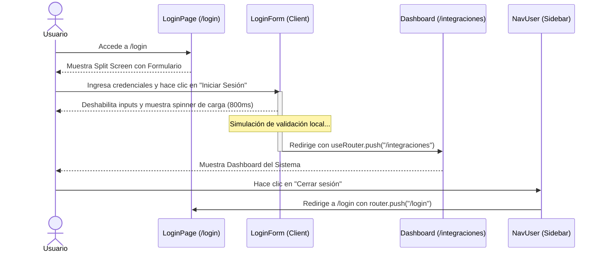

# Especificación de Diseño: Pantalla de Login Dividida (Split Screen)

Este documento detalla el diseño de la interfaz (UI) y la experiencia de usuario (UX) para la pantalla de inicio de sesión del Sistema de Integraciones del Poder Judicial de Santa Fe.

- **Fecha:** 2026-06-29
- **Estado:** Propuesto para revisión del usuario
- **Módulo Principal:** Inicio de Sesión (`/login`)
- **Enfoque Técnico:** Next.js App Router (Páginas fuera del grupo de rutas privadas), UI de Tailwind CSS v4, Lucide Icons, Shadcn Components.

---

## 1. Objetivos de Diseño y UX

1. **Alineación de Marca:** Utilizar el color verde institucional (`#104b45` en modo claro y su correspondiente paleta en modo oscuro) y el escudo oficial (`escudo.gif`) para transmitir formalidad y seguridad.
2. **Estructura Asimétrica:** Dividir la pantalla en dos secciones principales (Panel Institucional y Formulario) a partir de pantallas de tamaño mediano (`md`), y colapsar a una sola columna responsiva en dispositivos móviles.
3. **Flujo de Simulación:** Proveer un flujo interactivo que simule la carga de autenticación antes de redirigir al dashboard para optimizar el feedback visual.
4. **Desarrollo Amigable:** Mantener la navegación libre para los desarrolladores sin forzar bloqueos de ruta estrictos en esta fase (Opción B de comportamiento).

---

## 2. Arquitectura de Páginas y Archivos

Dado que los archivos privados están en el grupo de rutas `app/(private)/`, la pantalla de login se ubicará directamente bajo la raíz de `app/` para que no herede la barra lateral (sidebar) y el pie de página (footer) de la zona privada.

### Nuevos Archivos
- **[NEW] [page.tsx](file:///d:/SymfonyProyects/shadcn-dashboard-ui/app/login/page.tsx):** La página que renderizará la vista de login dividida en dos secciones.
- **[NEW] [login-form.tsx](file:///d:/SymfonyProyects/shadcn-dashboard-ui/components/login-form.tsx):** Componente de formulario que maneja los campos, estados interactivos de visibilidad de contraseña y envío simulado.

### Archivos a Modificar
- **[MODIFY] [nav-user.tsx](file:///d:/SymfonyProyects/shadcn-dashboard-ui/components/nav-user.tsx):** Modificar el botón "Cerrar sesión" para que limpie el estado de inicio de sesión simulado (si procede) y redirija a `/login`.

---

## 3. Estructura y Estilos de la UI (Split Screen)

### 3.1 Lateral Izquierdo: Panel Institucional (Oculto en móvil, visible en `md:flex`)
- **Fondo:** Color institucional `--sidebar` (`#104b45`) con un gradiente suave en diagonal (`bg-linear-to-br from-primary to-[#0a2f2b]`).
- **Logotipo:** Escudo oficial de la Provincia de Santa Fe (`escudo.gif`) posicionado en el centro en un contenedor circular con efecto de cristal (glassmorphism) y sombra sutil.
- **Textos:**
  - Título principal: "Sistema de Integraciones" (`text-3xl font-bold text-white`).
  - Subtítulo: "Poder Judicial de la Provincia de Santa Fe" (`text-sm text-white/70 tracking-wide uppercase mt-2`).
- **Aesthetic Premium:** Patrón decorativo abstracto en el fondo con opacidad baja (`opacity-5`) y transiciones de entrada suaves (`animate-fade-in`).

### 3.2 Lateral Derecho: Formulario de Acceso
- **Fondo:** Blanco limpio (`bg-background`) que se adapta al modo oscuro (`dark:bg-slate-950`).
- **Botón de Tema:** Componente `ModeToggle` posicionado arriba a la derecha de forma absoluta.
- **Formulario Centrado:**
  - **Cabecera del Formulario:** Título "Ingresar al Sistema" (`text-2xl font-semibold tracking-tight`) y descripción "Escriba sus credenciales de red para acceder" (`text-muted-foreground text-sm`).
  - **Campo de Usuario/Email:** Input con icono de `User` o `Mail` de fondo.
  - **Campo de Contraseña:** Input con botón `Eye` / `EyeOff` para alternar la visibilidad de los caracteres.
  - **Checkbox "Mantener sesión iniciada":** Usando el componente `Checkbox` y `Label` de Shadcn.
  - **Botón "Iniciar Sesión":** Botón de ancho completo (`w-full`) de tipo `primary` (`bg-[#104b45]` / `bg-primary`). Al presionar, muestra un spinner de carga (`Loader2` giratorio) y deshabilita los inputs durante la simulación de 800ms.

---

## 4. Diagrama de Flujo e Interacción

---

## 5. Plan de Verificación y Pruebas

### 5.1 Responsividad
- **Pantalla Grande (Desktop):** Verificar visualización 50/50 o 45/55 de la pantalla dividida. El escudo y la marca institucional deben verse nítidos a la izquierda.
- **Pantalla Pequeña (Mobile):** El panel institucional izquierdo debe ocultarse (`hidden md:flex`) y el formulario debe ocupar el 100% de la pantalla, centrándose de forma elegante.

### 5.2 Accesibilidad y UX del Formulario
- **Visibilidad de Contraseña:** Verificar que al hacer clic en el ojo, la contraseña cambie a tipo `text` y muestre los caracteres, y al hacer clic de nuevo regrese a tipo `password`.
- **Carga Interactiva:** Verificar que al iniciar sesión, el botón se ponga en estado de carga (spinner animado) y los inputs se deshabiliten temporalmente, previniendo múltiples clics accidentales.
- **Estilos de Modo Oscuro:** Comprobar que en modo oscuro, el panel derecho se adapte a un gris oscuro y los bordes de los inputs respeten la paleta nocturna del dashboard.
